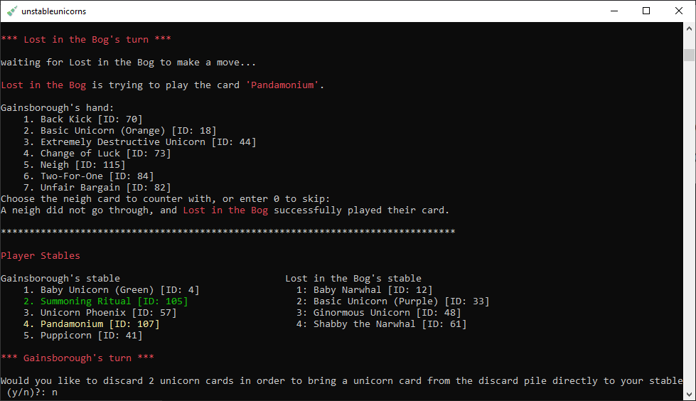

# Unstable Unicorns Online - Command Line ver.

This is a stripped down, proof-of-concept Console application of the card game Unstable Unicorns™ by TeeTurtle/Unstable Games. To play the game with other people online, you just need the executable and a Windows environment to run the Winsock functions for TCP connections and polling non-blocking sockets.

## 🦄 Game Rules ✨

Copied mostly verbatim from a mixture of the simplified and expanded rule set. A more in-depth overview can be found in the **[Unstable Unicorns Game Rules PDF](https://12ax7web.s3.amazonaws.com/accounts/2/homepage/UU_New-Rules_v1.pdf)**
 
Skip straight to the application-specific set-up and implementation **[#here](#-setting-up-and-starting-a-game-)**

---

### Objective

Unstable Unicorns is a turn-based strategic card game about your two favorite things: Unicorns and Destruction. The first person with the required number of unicorns in their Stable wins! Everyone must bow down to them. They shall hereafter be known as ✨The Righteous Ruler of All Things Magical✨... at least until the next game.

* 2 – 5 Players: 7 Unicorns to win
* 6 – 8 Players: 6 Unicorns to win

If the deck runs out of cards before any player reaches a winning number of Unicorns in their Stable, the player with the most Unicorns wins.

If two or more players tie for the most Unicorns in their Stable, each tied player must add up the number of letters in the names of all the Unicorn cards in their Stable. The player with the most letters wins.

If two or more players tie for the most Unicorns and the most letters, everyone loses. Ouch.

---

### How To Start

There are four piles that players have to look out for: the **Stable,** **Deck,** **Discard pile,** and **Nursery.** Unicorn cards, Upgrade cards, and Downgrade cards go to a player's Stable upon successful play. Cards are drawn from the deck, the discard pile is where cards that have been sacrificed, destroyed, or discarded go, and the Nursery is the stack of Baby Unicorn cards. 

Before the game can properly begin, each player must choose a Baby Unicorn card and place it in their **Stable.** Remaining Baby Unicorns reside in the Nursery stack, and Baby Unicorn cards that get removed from a player's Stable are always placed back in the Nursery. 

Once everyone has chosen their Baby Unicorn, five cards are automatically distributed to each player's hand, and the game starts with the host.

---

### What To Do On Your Turn

Turns go in numerical order from when players joined the server.

| Game Phase | Description |
| --- | --- |
| *Beginning of Your Turn* | Cards with effects that trigger at the beginning of a turn will prompt you to make an action |
| *Draw Phase* | A card is automatically drawn from the Draw Pile |
| *Action Phase* | Play 1 non-instant card from your hand OR draw 1 more card from the Draw Pile |
| *End of Your Turn* | Discard down to the hand limit if you are holding more than 7 cards |

---

### Common Card Effect Terms

| Effect | Description |
| --- | --- |
| *Draw* | Take a card from the deck and add it to your hand. |
| *Discard* | Move a card from your hand to the discard pile. |
| *Sacrifice* | Move a card in **your Stable** to the discard pile. |
| *Destroy* | Move a card from **any other player’s Stable** to the discard pile. |
| *Steal* | Move a card from any other player’s Stable into your Stable. |

---

### The Types of Cards

There are 5 types of cards in the game. Cards in a player's stable stay until they are sacrificed or destroyed.

* **Unicorn cards:** The three classifications here are all considered Unicorns, with the exception of player Stables under masquerade effects such as Pandamonium.
    * **Baby Unicorn:** Each player starts with a Baby Unicorn in their Stable. You can only summon more by using special cards!
    * **Basic Unicorn:** Gets played into your Stable. They don't have powers, but they are still special!
    * **Magical Unicorn:** Gets played into your Stable. Each one comes with a special power!
* **Magic:** These cards have a one-time effect; they get sent to the Discard Pile after use
* **Downgrade:** Play a Downgrade Card during your turn to give someone's Stable a negative effect. They can also go in your own Stable.
* **Upgrade:** Play an Upgrade Card during your turn to give someone's Stable a positive effect. (Your own Stable is always a good choice!)
* **Instant:** Play an Instant Card at any time to stop someone from playing a card from their hand; they get sent to the Discard Pile after use. Any number of Instant cards can be chained during a single turn.

## 📝 Setting-up and Starting a Game 🎮

This console application takes advantage of escape-character color codes for more distinguishable text and easier parsing. As a result, that feature has to be manually enabled or disabled through the Microsoft PowerShell.

**[Reference Link from CodeProject](https://www.codeproject.com/Tips/5255355/How-to-Put-Color-on-Windows-Console)**

**add:** `reg add HKEY_CURRENT_USER\Console /v VirtualTerminalLevel /t REG_DWORD /d 0x00000001 /f`
 
**undo:** `reg add HKEY_CURRENT_USER\Console /v VirtualTerminalLevel /t REG_DWORD /d 0x00000000 /f`

If done correctly, then the game window should look something like the following image

### Connecting through TCP sockets

The instructions detailed in the program should hopefully be straight-forward enough, but it's important to note that port forwarding is required to successfully host a game across Wi-Fi connections. The ports used in the program can be customizable between 1024 and 65535, and the other router settings and description don't matter too much as long as the selected Protocol is **TCP.**

A quick guide for Port Forwarding can be found at **[noip](https://www.noip.com/support/knowledgebase/general-port-forwarding-guide)**

## 🔔 Available Features 🔔

These will not be expanded upon due to prioritizing the full-fledged Windows GUI app version of this game.

* Only supports the 1st Print Base Deck, so there are no deck packs or Ultimate Unicorns. Each card effect should work though1, barring missed bugs
* Neigh cards have a limited window of 4 seconds to counter every card that's initially brought into play; any player that has not made a valid selection will get skipped
* Capable of hosting and joining games up to a maximum of 8 players through the same executable
* Manual unit and integration testing through a separate project and executable. This works by redirecting stdin to test file sources, launching a client application to send test data, and mocking certain functions with Macro defines
* Cool ASCII art courtesy of **[an image converter](https://manytools.org/hacker-tools/convert-images-to-ascii-art/),** a **[text converter](https://patorjk.com/software/taag/#p=display&f=Graffiti&t=Type%20Something%20),** and a person with the alias **[DR J](https://www.asciiart.eu/mythology/unicorns)**

1 While all of the cards are from the 1st Print, some of the card effects are taken from the 2nd Edition. This means that cards like "Extremely Fertile Unicorn" or "Puppicorn" are supported instead of "Unicorn Oracle" or "Caffeine Overload," but cards like "Seductive Unicorn" or "Unicorn Phoenix" use their 2nd Edition effects.